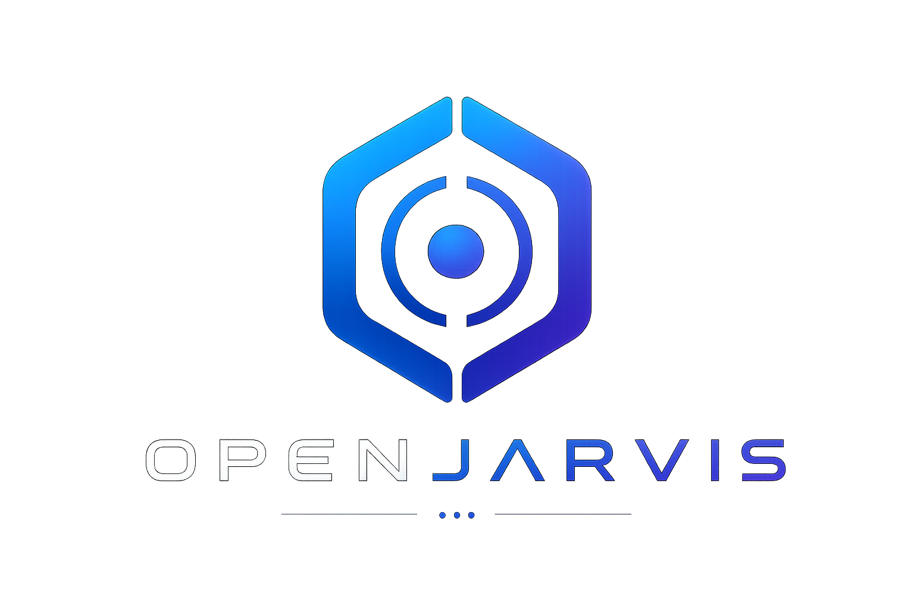

<div align="center">
  

  # OpenJarvis

  An open-source modular AI desktop assistant — built to learn the[Browser Use Agent SDK](https://github.com/browser-use/agent-sdk) hands-on, phase by phase.
</div>

---

> **Current state: v0** — Backend running with `/chat` + `/system` endpoints, Iron Man Style HUD frontend, auto-starts on login. Agent loop (Phase 1) is in progress.

---

## What's Built

| Component | Status |
|---|---|
| FastAPI backend — `/chat`, `/system` endpoints | Working |
| Iron Man HUD frontend (Tauri + Vite + TypeScript) | Built, needs Rust to run |
| Sidebar — live clock, CPU/RAM bars, shortcuts | Working |
| Voice input (Web Speech API) | Working |
| Multi-provider LLM config (Claude, GPT, Gemini, Groq, Ollama…) | Configured |
| Auto-start on login via macOS LaunchAgent | Working |
| Agent loop + tools | **In progress (Phase 1)** |

---

## Setup

### Backend

```bash
conda activate main_env        # or your env of choice
cd backend
cp .env.example .env           # fill in your API keys
uvicorn main:app --reload
```

Auto-start on login (macOS):
```bash
launchctl load ~/Library/LaunchAgents/com.openjarvis.backend.plist
```

Logs:
```bash
tail -f /tmp/jarvis-backend.log
tail -f /tmp/jarvis-backend-error.log
```

### Frontend (Tauri)

**Prerequisites:** [Node.js v18+](https://nodejs.org) · [Rust](https://rustup.rs)

```bash
cd frontend
npm install
npm run tauri dev
```

---

## Build Phases

| Phase | Focus | Status |
|---|---|---|
| 1 | Browser Use + search tool | **In progress** |
| 2 | SQLite memory, MCP integration | Planned |
| 3 | Tauri popup wired to backend, global hotkey | Planned |
| 4 | Voice input via Whisper (server-side) | Planned |
| 5 | Email, calendar tools | Planned |

---

## Adding a Tool

Create `backend/tools/your_tool.py`, subclass `ToolPlugin`, restart — the registry auto-discovers it. See [SKILLS.md](SKILLS.md) for the step-by-step guide and [CLAUDE.md](CLAUDE.md) for the full architecture.

---

## Supported LLM Providers

Configure in `backend/.env`:

```
ACTIVE_PROVIDER=anthropic   # anthropic | openai | gemini | groq | mistral | ollama
MODEL=claude-sonnet-4-6
```
