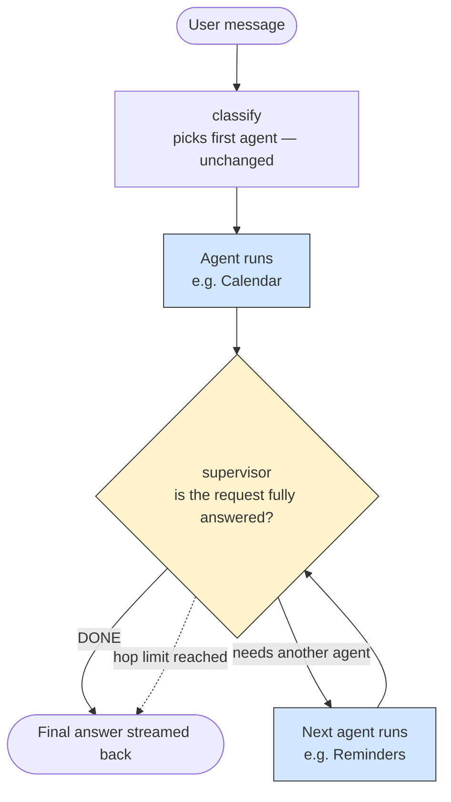

```mermaid
flowchart TD
    Start([User message]) --> Classify[classify<br/>picks first agent — unchanged]
    Classify --> AgentA[Agent runs<br/>e.g. Calendar]
    AgentA --> Supervisor{supervisor<br/>is the request fully answered?}
    Supervisor -->|DONE| End([Final answer streamed back])
    Supervisor -->|needs another agent| AgentB[Next agent runs<br/>e.g. Reminders]
    AgentB --> Supervisor
    Supervisor -.->|hop limit reached| End

    style Supervisor fill:#fff3cd,stroke:#333
    style AgentA fill:#d1e7ff,stroke:#333
    style AgentB fill:#d1e7ff,stroke:#333
```